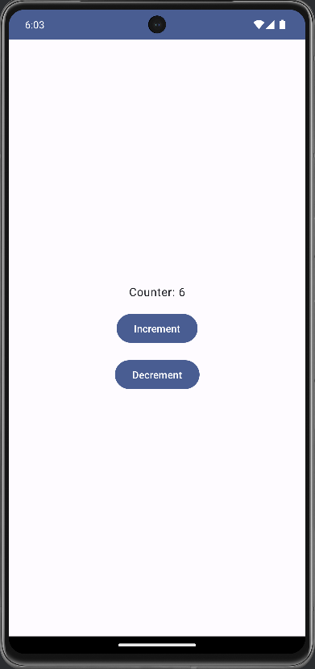
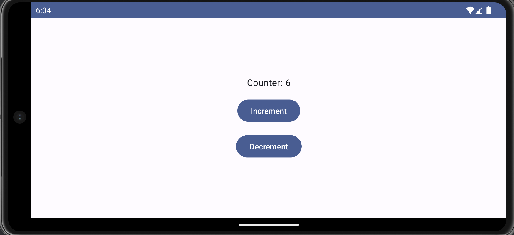

# CounterApp

CounterApp is a simple Android application built using Jetpack Compose and the MVVM architecture pattern. It allows users to increment and decrement a counter value. This project serves as a demonstration of how to use Jetpack Compose along with ViewModel to build reactive UIs in Android apps.

## Features

- **Increment and Decrement:** Users can increase or decrease the counter value with the tap of a button.
- **State Retention:** The app ensures that the counter value remains consistent across configuration changes like device rotation.

## Prerequisites

Before you begin, ensure you have met the following requirements:

- Android Studio Arctic Fox (2020.3.1) or later.
- Android SDK with Android 12 (API level 31) or later.

## Installation

To run the CounterApp project on your local machine, follow these steps:

1. Clone the repository to your local machine using Git:

    ```bash
    https://github.com/nishkarsh25/CounterAppMVVM.git
    ```

2. Open the project in Android Studio.

3. Build and run the project on an emulator or a physical device.

## Usage

Upon launching the app, you'll see the current value of the counter displayed on the screen. You can tap the "Increment" button to increase the counter value and the "Decrement" button to decrease it.

## State Retention

The CounterApp uses ViewModel and LiveData to retain the state of the counter value during configuration changes, such as rotating the device. This ensures that the counter value remains consistent and does not reset when the device orientation changes.

## Architecture

The project follows the MVVM (Model-View-ViewModel) architecture pattern:

- **Model:** The `CounterRepository` manages the data related to the counter.
- **View:** The `CounterScreen` composable function defines the UI for displaying the counter value and buttons.
- **ViewModel:** The `CounterViewModel` class acts as an intermediary between the View and the Model. It provides data to the View and handles user interactions.

## Screenshots


<!-- -->


## Contributing

Contributions are welcome! If you have any suggestions, improvements, or bug fixes, feel free to open an issue or create a pull request. Please follow the [Contributing Guidelines](CONTRIBUTING.md) when contributing to this project.

## License

This project is licensed under the MIT License. See the [LICENSE](LICENSE) file for details.

## Acknowledgements

- Jetpack Compose: A modern toolkit for building native Android UI.
- Android Jetpack: A set of libraries, tools, and guidance to help developers write high-quality apps more easily.
